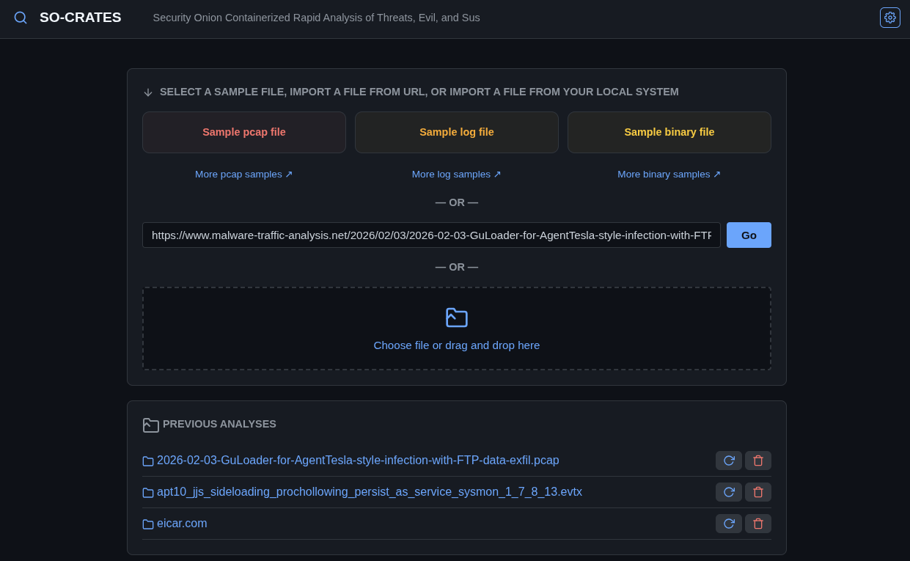
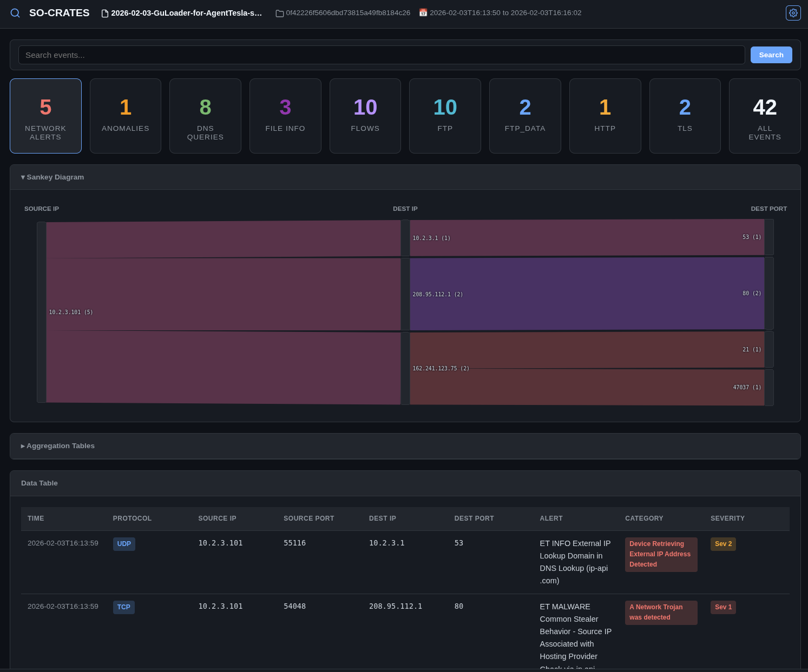
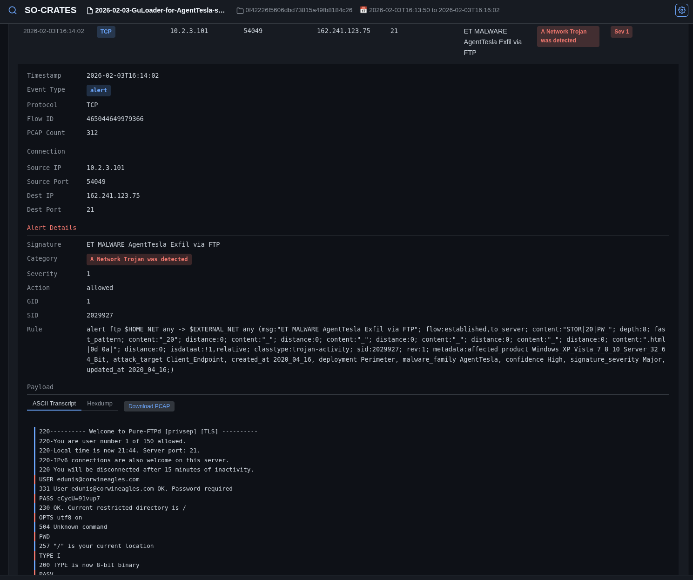
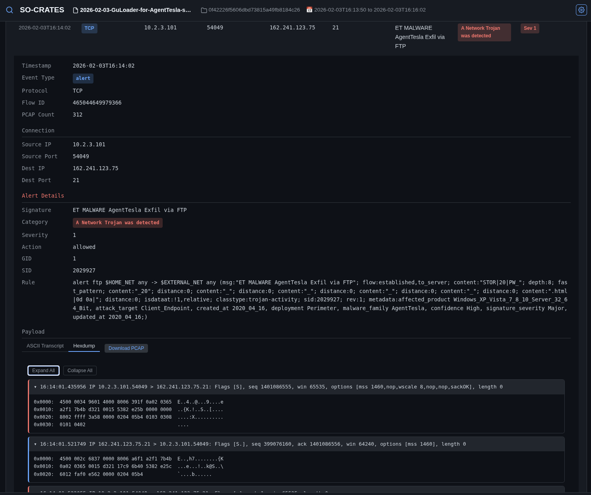
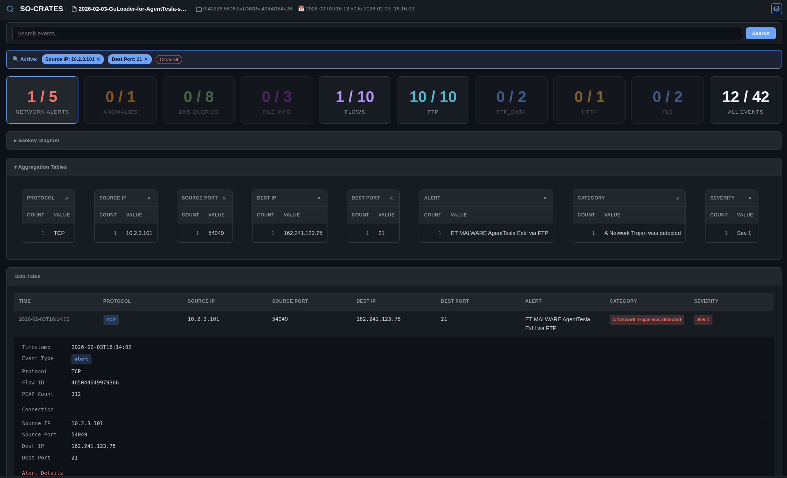

# SO-CRATES

Security Onion Containerized Rapid Analysis of Threats, Evil, and Sus

A standalone web application for analyzing pcap files, log files, and binary files. Features include Suricata network analysis, YARA binary scanning, Sigma rule detection for logs, and a single-page UI for browsing alerts, metadata, transcripts, and hexdumps.

## Screenshots

When you first connect to SO-CRATES, a window will appear with an overview of SO-CRATES:


If you need to refer to this again later, you can click the ? in the upper right corner of the main screen.

The main screen allows you to upload a file or load a previous analysis:



After analysis, you can view network alerts, file alerts, network metadata, and extract streams:



When you find something interesting, you can drill into the row in the data table at the bottom. This will allow you to see the ASCII transcript:



You can also select the hexdump view:



To slice and dice your data, expand the Aggregation Tables section and click on values that you want to filter for:



## Table of Contents

- [Quick Demo](#quick-demo)
- [Quick Installation](#quick-installation)
  - [OhMyDebn](#ohmydebn)
  - [Docker](#docker)
    - [docker run](#docker-run)
    - [docker compose](#docker-compose)
    - [Air-Gapped / Offline Deployment for Docker](#air-gapped--offline-deployment-for-docker)
    - [Build Your Own Docker Image](#build-your-own-docker-image)
  - [Podman](#podman)
    - [podman run](#podman-run)
    - [podman compose](#podman-compose)
    - [Air-Gapped / Offline Deployment for Podman](#air-gapped--offline-deployment-for-podman)
    - [Build Your Own Podman Image](#build-your-own-podman-image)
- [Manual Installation](#manual-installation)
  - [Environment Variables](#environment-variables)
- [Usage](#usage)
  - [Analyze a File](#analyze-a-file)
  - [Navigate Results](#navigate-results)
  - [Stream Analysis](#stream-analysis)
- [Data Storage](#data-storage)
- [Configuration](#configuration)
- [Security](#security)
- [Development](#development)
- [Credits](#credits)
- [Testing](#testing)
- [License](#license)

## Quick Demo

The fastest way to try SO-CRATES is with our online demo:

https://securityonion.net/socrates-demo

Please note the following:
- this is a cloud-based service so please do not share any sensitive files or any other sensitive info
- free accounts are limited to 60 minutes of usage before the instance is automatically terminated
- if you need a private or permanent instance of SO-CRATES, then you can proceed to the next section to perform a local installation of SO-CRATES

## Quick Installation

For a private or permanent instance of SO-CRATES, most folks will want to use our pre-built container image. We publish a container image that is compatible with both Docker and Podman. If you prefer not to use a pre-built image, then there are other options shown [below](#manual-installation).

### OhMyDebn

If you are running the latest version of [OhMyDebn](https://ohmydebn.org), then you can just press `Ctrl + Alt + S` to automatically install and run SO-CRATES and then you can skip to the [Usage](#usage) section below.

### Docker

#### docker run

If you prefer `docker run`, then here are the steps you can use on Debian 13 or compatible distros:
```bash
# Install and configure docker.io
sudo apt update && sudo apt -y install docker.io && sudo usermod -aG docker $USER
# Create data directory
mkdir -p ~/socrates-data
# Start SO-CRATES
newgrp docker -c "docker run -v ~/socrates-data:/data -p 8000:8000 ghcr.io/dougburks/so-crates:main"
```

#### docker compose

If you prefer to use `docker compose`, then here are the steps you can use on Debian 13 or compatible distros:
```bash
# Install and configure docker.io and docker-compose
sudo apt update && sudo apt -y install docker.io docker-compose && sudo usermod -aG docker $USER
# Download docker-compose.yml
wget https://raw.githubusercontent.com/dougburks/so-crates/refs/heads/main/docker-compose.yml
# Create data directory
mkdir -p socrates-data
# Start SO-CRATES (add the -d option to run in the background if desired)
newgrp docker -c "docker compose up"
```

To stop:
```bash
docker compose down
```

To restart:
```bash
docker compose restart
```

#### Air-Gapped / Offline Deployment for Docker

Our container image bakes in the Emerging Threats Open ruleset at build time, so it works without internet access. To copy to an isolated network, pull and save the container image using an internet-connected machine:

```bash
docker pull ghcr.io/dougburks/so-crates:main
docker save ghcr.io/dougburks/so-crates:main > so-crates.tar
```

Then transfer so-crates.tar to the isolated network via USB or other media. On the air-gapped machine:
```bash
docker load < so-crates.tar
docker run -v ~/socrates-data:/data -p 8000:8000 ghcr.io/dougburks/so-crates:main
```

#### Build Your Own Docker Image

If you prefer to build your own Docker image, you can clone this github repo and then build the image:

```bash
git clone https://github.com/dougburks/so-crates
cd so-crates
docker build -t so-crates .
mkdir -p ~/socrates-data
docker run -v ~/socrates-data:/data -p 8000:8000 so-crates
```

### Podman

#### podman run

If you prefer Podman (rootless, daemonless), then here are the steps you can use on Debian 13 or compatible distros:
```bash
# Install podman
sudo apt update && sudo apt -y install podman
# Create data directory
mkdir -p ~/socrates-data
# Start SO-CRATES
podman run --userns=keep-id --user $(id -u):$(id -g) \
  -v $HOME/socrates-data:/data -p 8000:8000 \
  ghcr.io/dougburks/so-crates:main
```

No `usermod` or `newgrp` is needed since Podman runs rootless by default. Use `$HOME` instead of `~` for the volume mount to avoid path expansion issues. The `--userns=keep-id --user $(id -u):$(id -g)` flags ensure files written to `~/socrates-data` are owned by your host user.

#### podman compose

If you prefer to use `podman compose`, then here are the steps you can use on Debian 13 or compatible distros:
```bash
# Install and configure podman and podman-compose
sudo apt update && sudo apt -y install podman podman-compose
# Download compose files
wget https://raw.githubusercontent.com/dougburks/so-crates/refs/heads/main/docker-compose.yml
wget https://raw.githubusercontent.com/dougburks/so-crates/refs/heads/main/docker-compose.podman.yml
# Create data directory
mkdir -p socrates-data
# Start SO-CRATES (add the -d option to run in the background if desired)
podman compose -f docker-compose.podman.yml up
```

The `docker-compose.podman.yml` file extends `docker-compose.yml` and adds `user` and `userns_mode` flags so files written to `~/socrates-data` are owned by your host user — the same behavior as `--userns=keep-id --user $(id -u):$(id -g)` in `podman run`.

To stop:
```bash
podman compose -f docker-compose.podman.yml down
```

To restart:
```bash
podman compose -f docker-compose.podman.yml restart
```

#### Air-Gapped / Offline Deployment for Podman

Our container image bakes in the Emerging Threats Open ruleset at build time, so it works without internet access. To copy to an isolated network, pull and save the container image using an internet-connected machine:

```bash
podman pull ghcr.io/dougburks/so-crates:main
podman save ghcr.io/dougburks/so-crates:main > so-crates.tar
```

Then transfer so-crates.tar to the isolated network via USB or other media. On the air-gapped machine:
```bash
podman load < so-crates.tar
podman run --userns=keep-id --user $(id -u):$(id -g) \
  -v $HOME/socrates-data:/data -p 8000:8000 ghcr.io/dougburks/so-crates:main
```

#### Build Your Own Podman Image

If you prefer to build your own Podman image, you can clone this github repo and then build the image:

```bash
git clone https://github.com/dougburks/so-crates
cd so-crates
podman build -t so-crates .
mkdir -p ~/socrates-data
podman run --userns=keep-id --user $(id -u):$(id -g) \
  -v $HOME/socrates-data:/data -p 8000:8000 so-crates
```

SO-CRATES will check for internet access, update its NIDS rules if online (or use the baked-in rules if offline), and then prompt you to open http://localhost:8000/socrates.html in your browser.

To stop a `docker run` or `podman run` instance, just press Ctrl-C in the terminal window or close the terminal window altogether. For `docker compose` or `podman compose`, use `docker compose down` or `podman compose down`.

## Manual Installation

If you prefer to run without Docker or Podman, then you will need these prerequisites:

- **Python 3** (stdlib only — no pip packages required)
- **Suricata** — for PCAP analysis and rule-based alerting
- **suricata-update** — for downloading/updating Suricata rules (internet access required; the app will warn and continue without rules if offline)
- **tcpdump** — for stream carving (`/api/download-stream`) and hexdump extraction (`/api/hexdump-stream`)
- **tshark** — for ASCII transcript extraction (`/api/ascii-stream`)
- **yara** (optional) — for scanning extracted files. If installed, SO-CRATES automatically downloads YARA rules on first run (or uses baked-in rules in Docker). If missing, file extraction and File Alerts are skipped.
- **Zircolite** (optional) — for Sigma rule detection on log files. SO-CRATES auto-detects if Zircolite is installed and skips log analysis if absent. The Dockerfile bakes in Zircolite v3.7.1.

Once you have the prerequisites, then you can clone this github repo and run the server:
```bash
python3 socrates.py
```

Then open http://localhost:8000/socrates.html in your browser.

### Environment Variables

| Variable | Default | Description |
|---|---|---|
| `DATA_DIR` | `~/socrates-data` | Directory for analyzed files and Suricata config |
| `BIND_ADDRESS` | `127.0.0.1` | Address to bind the HTTP server to |
| `PORT` | `8000` | HTTP server port |

Environment variables override the hardcoded defaults at startup.

## Usage

Once you've connected to SO-CRATES in your browser, here are some of the things you can do.

### Analyze a File

1. **Upload a file** — click "Choose File" and select a `.pcap`, `.pcapng`, `.cap`, `.trace`, `.evtx`, `.json`, `.jsonl`, `.csv`, `.xml`, `.log`, or any other file type (or a `.zip` containing one). File types are auto-detected:
   - **PCAP** files → Suricata network analysis
   - **Log files** (`.evtx`, `.json`, `.jsonl`, `.csv`, `.xml`, `.log`) → Zircolite Sigma rule detection
   - **Other files** → YARA binary scanning
2. **Load from URL** — paste a URL to a file and press **Enter** (or click **Go**). Password-protected zips from `malware-traffic-analysis.net` are auto-decrypted using the date-based password format
3. **Reopen a previous analysis** — previously analyzed files are listed on the welcome screen
4. **Re-analyze a previous file** — click the 🔄 button next to any previous file to delete its analysis and re-run the pipeline. Rules are updated first if internet access is available

### Navigate Results

After analysis completes, the UI displays different views depending on the file type:

**For PCAP files:**
- **Stats Grid** — clickable cards showing event counts by type (Alerts, DNS, HTTP, TLS, Flows, etc.)
- **Sankey Diagram** — expand the collapsible heading to visualize network flow relationships (Source IP → Dest IP → Dest Port)
- **Aggregation Tables** — frequency counts for each column; click a value to filter
- **Data Table** — sortable table with expandable detail rows showing full event JSON, ASCII transcripts, and hexdumps
- **Search** — full-text search across all event data using SQLite FTS5 (falls back to `LIKE` if FTS5 is unavailable)
- **Filtering** — apply filters by clicking aggregation values; filter chips show active filters; filters persist across all tabs and the Sankey diagram

**For log files (`.evtx`, `.json`, `.csv`, `.xml`, `.log`):**
- **Sigma Alerts** — detections matched by Sigma rules, with severity, MITRE techniques, and rule metadata
- **Log Events** — all parsed log events with dynamic column discovery based on the actual data
- **Aggregation Tables** — filterable counts for discovered fields (Channel, EventID, Image, Source IP, etc.)
- **Search & Filtering** — same full-text search and aggregation-click filtering as PCAP mode

**For binary files:**
- **File Info** — metadata extracted from the file
- **YARA Matches** — any rules that matched, with tags and author attribution

### Stream Analysis

Click any row in a data table to expand it, then:
- **ASCII Transcript** — view decoded TCP/UDP payload as readable text
- **Hexdump** — view per-packet hex dumps with collapsible packet headers
- **Download PCAP** — carve that specific stream into a standalone `.pcap` file

## Data Storage

All analyzed files are stored in `~/socrates-data/`. Each analysis gets a subdirectory named by its MD5 hash containing:

```
~/socrates-data/
  suricata/
    suricata.yaml          # Copied from /etc/suricata/, rule path rewritten
    rules/
      suricata.rules       # Downloaded by suricata-update (online) or copied from baked-in image (offline/air-gapped)
    disable.conf
  zircolite/               # Zircolite source (auto-cloned on first run if not present)
  sigma-rules/
    windows.json           # Pre-compiled Sigma rules for Windows logs
    linux.json             # Pre-compiled Sigma rules for Linux logs
  <md5>/
    <original-filename>        # The uploaded file
    .meta                      # Analysis metadata (file type, extracted name, version)
    eve.json                   # Suricata's JSON output (PCAP only)
    events.db                  # SQLite database (alerts + events + log events + sigma alerts)
    name.txt                   # Human-readable display name
    filestore/                 # Extracted files from Suricata file-store (PCAP only)
    yara_matches.json          # YARA scan results (binary files)
    sigma_matches.json         # Sigma detection results (log files)
```

## Configuration

| Constant | Default | Description |
|---|---|---|
| `PORT` | `8000` | HTTP server port |
| `DATA_DIR` | `~/socrates-data` | Root directory for analyzed files |
| `MAX_UPLOAD_SIZE` | `1000 MB` | Maximum file upload size |
| `MAX_EVE_SIZE` | `1000 MB` | Maximum eve.json size |
| `MAX_TRANSCRIPT_SIZE` | `100,000 chars` | Maximum ASCII transcript / hexdump length |

Suricata config is auto-generated from `/etc/suricata/` on first run. Rules are downloaded via `suricata-update` when internet access is available; otherwise, the app uses baked-in rules (Docker/Podman) or warns and continues without rules (source).

## Security

- Binds to `127.0.0.1` only (no external access)
- No CORS wildcard
- Input validation on all endpoints (IP, port, MD5, path traversal)
- File type detection (PCAPs get full Suricata analysis; non-PCAPs get YARA-only scanning)
- URL safety checks (blocks localhost, private IPs, resolves hostname)
- Zip-slip prevention on archive extraction
- Generic error messages (no internal details leaked)

## Development

See [docs/ARCHITECTURE.md](docs/ARCHITECTURE.md) for a detailed overview of how the pieces fit together.

See [docs/API.md](docs/API.md) for the full API reference.

See [docs/FILTERING.md](docs/FILTERING.md) for details on the filtering system.

See [docs/AGENTS.md](docs/AGENTS.md) for agent-focused guidance on maintaining SO-CRATES, including updating vendored dependencies.

## Credits

SO-CRATES is built on top of several excellent open-source projects:

| Project | License | Purpose | Website |
|---------|---------|---------|---------|
| [Suricata](https://suricata.io/) | GPLv2 | Network traffic analysis and IDS | https://suricata.io/ |
| [Zircolite](https://github.com/wagga40/Zircolite) | LGPLv3 | Sigma rule detection for log files | https://github.com/wagga40/Zircolite |
| [YARA](https://virustotal.github.io/yara/) | BSD-3-Clause | Malware pattern matching | https://virustotal.github.io/yara/ |
| [SigmaHQ Rules](https://github.com/SigmaHQ/sigma) | LGPLv3 (detections) | Detection logic for log analysis | https://github.com/SigmaHQ/sigma |
| [YARA Forge](https://github.com/YARAHQ/yara-forge) | Various | Curated YARA rules | https://github.com/YARAHQ/yara-forge |
| [Emerging Threats Open](https://rules.emergingthreats.net/) | MIT | Suricata network rules | https://rules.emergingthreats.net/ |
| [D3](https://d3js.org/) | ISC | Sankey diagram visualization | https://d3js.org/ |

## Testing

```bash
# Server tests
python3 -m unittest tests.test_socrates_server -v

# UI tests
python3 -m unittest tests.test_socrates_ui -v

# All tests
python3 -m unittest discover -v
```

## License

See [LICENSE](LICENSE)
